# Symmetrical Polyhedra Composed of Two Boxes
The code here generates symmetrical, two-box polyhedra with a number of other constraints. In practice, the user specifies the overall dimensions of the desired two-box object and the requested deviations from rectangularity. 

<figure>
  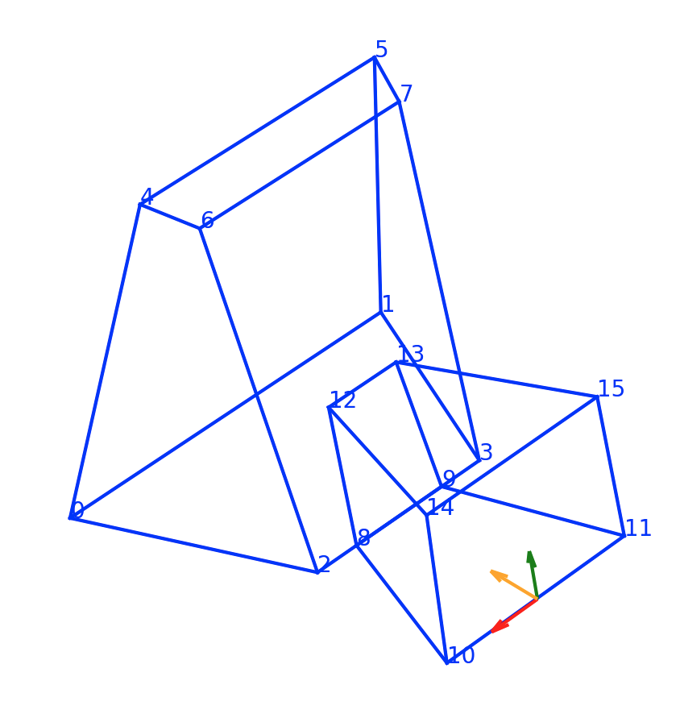
  <figcaption>Figure 1: An example of a symmetrical object composed of two boxes. The origin and axes of the coordinate system the object is generated in are shown. Red, green and orange are the x,y,z axes respectively. </figcaption>
</figure>

## Introduction
Figure 1 shows a symmetrical, two-box object. There is always a "big box" (vertices 0-7) and a "small box" (vertices 8-15). Two-box objects are generated by specifying a series of constraints that a two-box object must satisfy and then sampling from the set of all objects that satisfy each of the constraints. There are many constraints and each is enumerated in the Constraints section. 

In general, constraints encode things like "vertices 0,2,6,4 must be coplanar" or impose orderings in depth like "vertex 12 must have depth greater than vertex 14". Constraints like the latter tend to help ensure that certain topological requirements are met. (e.g. The small box must not be inside the large box.) Also, vertices (0,1,2,3,8,9,10,11) are always coplanar. 

Another major constraint is bilateral symmetry. Note that in Figure 1, vertices $(i, i+1)$ are symmetry correspondences, for all even $i$. In the generation process, the symmetry plane is set to be $x=0$. The object is generated by specifying the part of the object on one side of $x=0$, and then reflecting across $x=0$. 

The user specifies the desired overall dimensions of the object and also, for each of the faces, a desired angular deviation from parallelism with one of the coordinate system axes. 

The variables describing a shape are $(x_i,y_i,z_i)$, $i \in \{0,2,4,6,8,10,12,14\}$ (24 total) and also 7 plane intercepts, $d_{0,1,5,4}$, $d_{4,5,6,7}$, $d_{2,3,7,6,8,9,12,13}$, $d_{0,2,6,4}$, $d_{8,10,14,12}$, $d_{12,13,15,14}, d_{10,11,15,14}$, where the subscripts indicate the vertices belonging to the appropriate plane. These 31 variables are combined into a vector $x$.

The numerous constraints are all of one of three types, (1) Linear equality constraints, (2) linear inequality constraints, (3) quadratic inequality constraints. Aggregating all of the constraints into matrices, we seek to sample from set $S$, defined below. 

$$
S = \{x: Ax = b,\  Cx \leq d,\  x^TQx \leq 0\}
$$

All vectors $x$ satisfying the linear equality constraint can be expressed as follows, where $A^+$ is the pseudoinverse of $A$, $U$ is an orthonormal basis for the null space of $A$ and $w$ is an arbitrary vector. In this case, $w \in \mathbb{R}^3$. Matrices $A^+$ and $U$ are constructed from the SVD of $A$. 

$$
x = A^+b + (I - A^+A)w = A^+b + Uw
$$

Using this formula for $x$, set $S$ can be rewritten as follows. There is a one-to-one mapping between each $w$ and a 3D shape in $S$. 

$$
\begin{align*}
E &= CU \\
F &= d - CA^+b \\
P &= U^T QU \\
q &= 2U^TQA^+b\\
r &= b^T(A^+)^TQA^+b \\
S &=  \{w: Ew \leq F,\ \   w^T Pw + q^Tw +r \leq 0 \}
\end{align*}
$$

## Sampling from S
Sampling from $S$ is complicated by a quadratic constraint that can take several forms. 

### Case 1
If $P = 0$ everywhere, then the second constraint reduces to $q^Tw + r \leq 0$ and is folded into $E$ and $F$.  
$$
S =  \bigg\{w: \begin{pmatrix}E \\q^T\end{pmatrix}w \leq \begin{pmatrix}F \\-r\end{pmatrix}\bigg\}
$$

### Case 2
If, for every $w$ such that $Ew \leq F$, $w^T Pw + q^Tw +r \leq 0$, then the second constraint is redundant and is ignored. 
$$
S =  \{w: Ew \leq F \}
$$

With Case 1 or Case 2, $S$ is a bounded, convex polytope. It is convex because its shape is defined as the intersection of many half-spaces. $S$ is bounded because I added enough constraints to ensure that it is. The corners of $S$ are computed using the [polytope](https://github.com/tulip-control/polytope) python package. Because $S$ is convex, weighted averages of it's corners are also members of $S$. So, uniform samples from $S$ are generated by uniformly sampling convex combination weights and averaging the corners according to those weights. 

### Case 3
Another possibility is that the user attempted to build an impossible shape. A 2D analogy would be trying to build a symmetrical trapezoid where (1) the top and bottom are horizontal, (2) the sides form 45 degree angles with the top or bottom and (3) the trapezoid is 3 units tall and 2 units wide. 

In this case, $S = \varnothing$, meaning no $w$ exists that satisfies the constraints. When this happens, an error is raised or the program tries again with a different set of constraints. 

A point in the feasible region is generated (or not) by attempting to solve the optimization problem below. If a solution exists, it is the starting point for Case 4, otherwize error. 

$$
\begin{align*}
argmin_w \quad&0 \\
s.t.\quad Ew &\leq F \\
w^T Pw + q^Tw +r &\leq 0
\end{align*}
$$

*Note: Currently this optimization problem is specified using pyomo and passed to ipopt, which works well but there are unfortunately a lot of dependencies. This step should probably be converted to use scipy.*

### Case 4
This is the general case. Empirically (and unfortunately), $P$ always appears to be nonconvex. If it were convex, hit and run sampling would be the standard approach. So far as I can tell, proofs about the effectiveness of hit and run in nonconvex spaces depend on properties that may or may not be achieved here. **If Case 4 happens, hit and run sampling is performed**. It never produces  samples outside of the feasible region, but is perhaps a suboptimal way to sample $S$.  It seems adequate for this purpose.
 
$$
S =  \{w: Ew \leq F,\ \   w^T Pw + q^Tw +r \leq 0 \}
$$


<figure>
  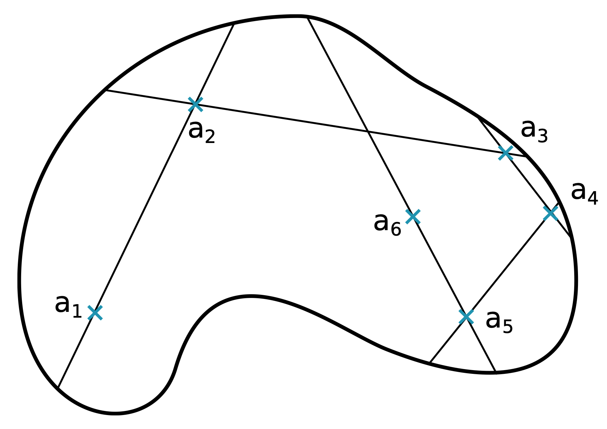
  <figcaption>Figure 2: A visualization of hit and run sampling. The croissant shaped lump is the feasible region. Start at some point in the feasible region. Pick a random direction. A starting point and a direction specify a line. Uniformly sample a point from the set defined as the intersection of the line and the feasible region. Repeat. Image source: <a href="https://arxiv.org/pdf/1610.08865">https://arxiv.org/pdf/1610.08865</a> </figcaption>
</figure>


## Examples
Here is a basic example of how to generate a symmetrical two box object. 
```{python}
rng = np.random.default_rng(seed=1234)
angle_dct = {
	"big_right":rng.uniform(10,20) * rng.choice([1,-1]), 
	"small_right":rng.uniform(10,15) * rng.choice([1,-1]), 
	"big_top":rng.uniform(-20,20), 
	"big_front":rng.uniform(-20,20), 
	"big_back":rng.uniform(-20,20),
	"small_top":rng.uniform(-10,10),
	"small_front":rng.uniform(-10,10),
	"tilt_big_right":rng.uniform(0,360),
	"tilt_small_right":rng.uniform(0,360)
	}


tbf = TwoBoxFamily(width_x=7, height_y=7, depth_z=7, angles=angle_dct, rng=rng)
obj = tbf.sample()
show_solid(obj) # view solid object
# obj.show() # view transparent object
```
<figure>
  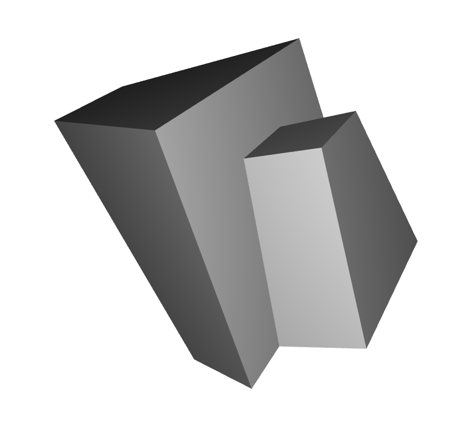
  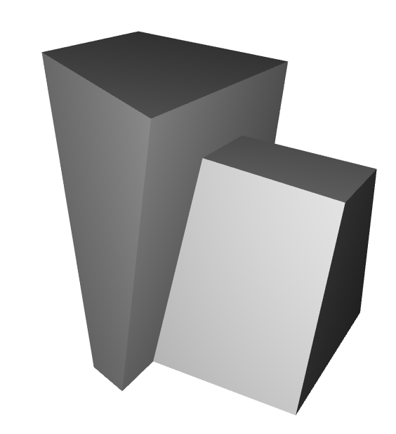
  <figcaption>Figure 3: Two objects in the same family. They have the same overall dimensions and the faces are oriented in the same direction but the relative size of big box and small box differ. </figcaption>
</figure>


## Constraints

```{python}
constraint_writer(width_x=7, height_y=7, depth_z=7, angles=angle_dct)
```
The constraint_writer function prints out the constraints and a particular example of the output is shown below. 
```
-----------------------
EQUALITY CONSTRAINTS
-----------------------
0.941 * x0 + 0.076 * y0 + 0.330 * z0 + 1.000 * big_right = 0.0
0.941 * x2 + 0.076 * y2 + 0.330 * z2 + 1.000 * big_right = 0.0
0.941 * x4 + 0.076 * y4 + 0.330 * z4 + 1.000 * big_right = 0.0
0.941 * x6 + 0.076 * y6 + 0.330 * z6 + 1.000 * big_right = 0.0
0.986 * y4 + -0.166 * z4 + 1.000 * big_top = 0.0
0.986 * y6 + -0.166 * z6 + 1.000 * big_top = 0.0
-0.126 * y2 + -0.992 * z2 + 1.000 * big_front = 0.0
-0.126 * y6 + -0.992 * z6 + 1.000 * big_front = 0.0
-0.126 * y8 + -0.992 * z8 + 1.000 * big_front = 0.0
-0.126 * y12 + -0.992 * z12 + 1.000 * big_front = 0.0
-0.263 * y0 + 0.965 * z0 + 1.000 * big_back = 0.0
-0.263 * y4 + 0.965 * z4 + 1.000 * big_back = 0.0
0.996 * y12 + -0.090 * z12 + 1.000 * small_top = 0.0
0.996 * y14 + -0.090 * z14 + 1.000 * small_top = 0.0
-0.063 * y10 + -0.998 * z10 + 1.000 * small_front = 0.0
-0.063 * y14 + -0.998 * z14 + 1.000 * small_front = 0.0
0.968 * x8 + 0.251 * y8 + 0.022 * z8 + 1.000 * small_right = 0.0
0.968 * x10 + 0.251 * y10 + 0.022 * z10 + 1.000 * small_right = 0.0
0.968 * x12 + 0.251 * y12 + 0.022 * z12 + 1.000 * small_right = 0.0
0.968 * x14 + 0.251 * y14 + 0.022 * z14 + 1.000 * small_right = 0.0
1.000 * y0 = 0.0
1.000 * y2 = 0.0
1.000 * y8 = 0.0
1.000 * y10 = 0.0
1.000 * x2 = 3.5
1.000 * y4 = 7.0
1.000 * z4 = 7.0
1.000 * z14 = 0.0
-----------------------
INEQUALITY CONSTRAINTS
-----------------------
-1.000 * z0 + 1.000 * z2 <= 0.000
-1.000 * z2 + 1.000 * z10 <= 0.000
1.000 * y8 + -1.000 * y12 <= 0.000
1.000 * y10 + -1.000 * y14 <= 0.000
-1.000 * x2 + 1.000 * x8 <= 0.000
-1.000 * y6 + 1.000 * y12 <= 0.000
-1.000 * y6 + 1.000 * y14 <= 0.000
-1.000 * x0 <= -0.350
-1.000 * x2 <= -0.350
-1.000 * x4 <= -0.350
-1.000 * x6 <= -0.350
-1.000 * x8 <= -0.350
-1.000 * x10 <= -0.350
-1.000 * x12 <= -0.350
-1.000 * x14 <= -0.350
1.000 * y0 + -1.000 * y4 <= -0.700
1.000 * y2 + -1.000 * y6 <= -0.700
-1.000 * z0 + 1.000 * z2 <= -0.700
-1.000 * z4 + 1.000 * z6 <= -0.700
-1.000 * z12 + 1.000 * z14 <= -0.700
-1.000 * z8 + 1.000 * z10 <= -0.700
1.000 * y8 + -1.000 * y12 <= -0.700
1.000 * y10 + -1.000 * y14 <= -0.700
-1.000 * x2 + 1.000 * x8 <= -0.700
-----------------------
QUADRATIC CONSTRAINT
-----------------------
-1.000 * y6 * x2 + 1.000 * y12 * x2 + -1.000 * y12 * x6 + 1.000 * x12 * y6 <= 0
```
The first 20 equality constraints impose the planarity constraints. The last 8 equality constraints ensure the overall dimensions are correct and the bottom of the two-box object is in the plane $y=0$. The inequality constraints ensure minimum edge lengths. The quadratic constraint helps ensure that vertex 12 is inside the quadrilateral given by vertices 2,3,7,6.

For the quadratic constraint, note that
* The line between $(x_2,0)$ and $(x_6, y_6)$ can be expressed as $(a,b,c) \cdot (x,y,1) = 0$, where $(a,b,c) = (y_6, x_2-x_6, -x_2y_6)$. 
* The origin $(0,0)$ is always on the side of the line that we want $(x_{12}, y_{12})$ to be on.
* Because $x_2 > 0$ and $y_6>0$, $(a,b,c) \cdot (0,0,1) \leq 0$ so all points on the same side of the line between $(x_2,0)$ and $(x_6, y_6)$ as the origin have  $(a,b,c) \cdot (x,y,1) \leq 0$. Plugging in $(x_{12}, y_{12})$, we get the quadratic constraint written below and in the constraint list. 
* $x_{12}y_6 + x_2y_{12} - x_6y_{12} - x_2y_6 \leq 0$

## Real-World Objects 
The [ModelNet40 Dataset](https://modelnet.cs.princeton.edu) is a set of 3D models split into 40 categories. 

```
mesh = o3d.io.read_triangle_mesh("path_to_mesh")
mesh.compute_vertex_normals()
o3d.visualization.draw_geometries([mesh],point_show_normal=True)
```
<figure>
  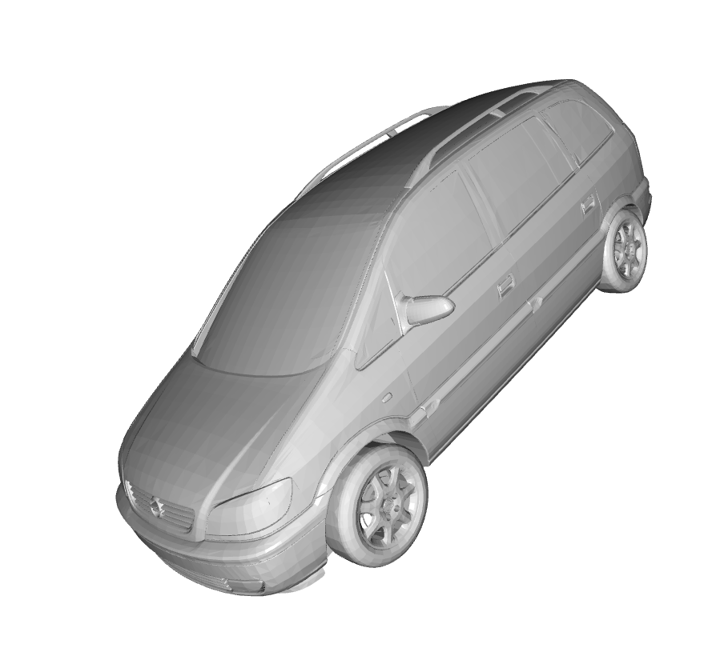
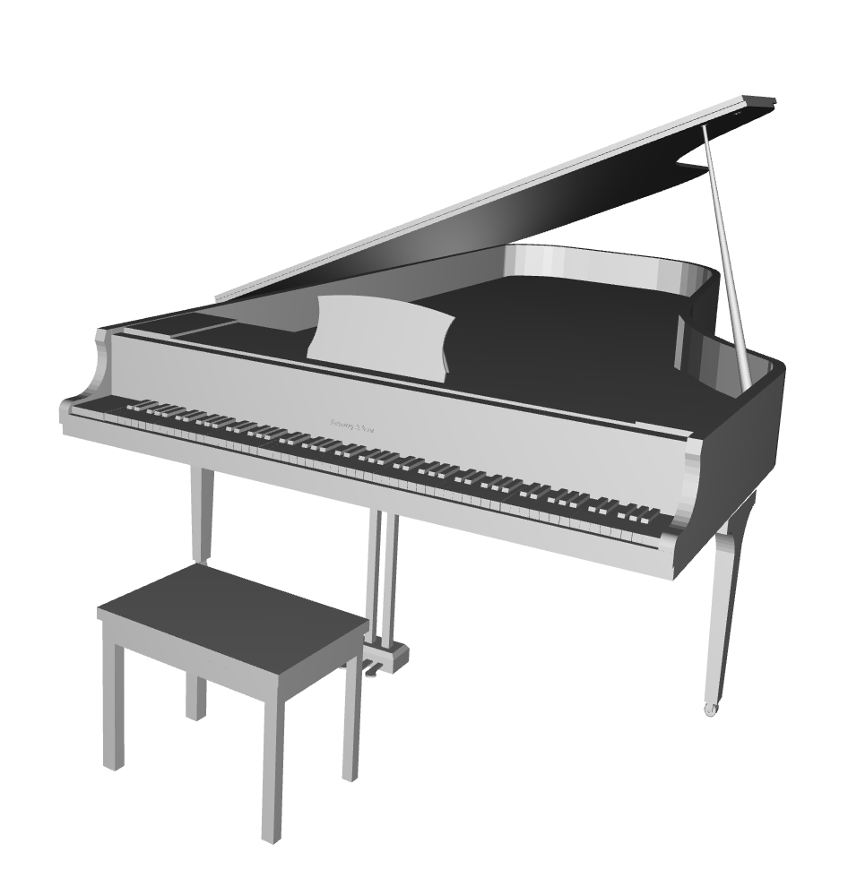

  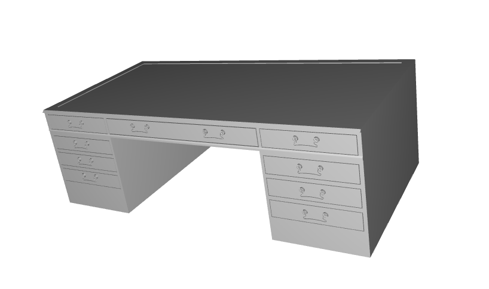

  <figcaption>Figure 4: A few examples of shapes from ModelNet40. </figcaption>
</figure>

## Asymmetrical Two-Box Objects
### Spherical Perturbations 
One easy way to reduce symmetry and planarity is to add random perturbations to each vertex position as shown in Figure 5. 
```{python}
obj = tbf.sample()
obj.xyz += rng.normal(loc = 0, scale = .4, size=obj.xyz.shape)
show_solid(obj.xyz, obj.triangles, edges=obj.edges)
```
<figure>
  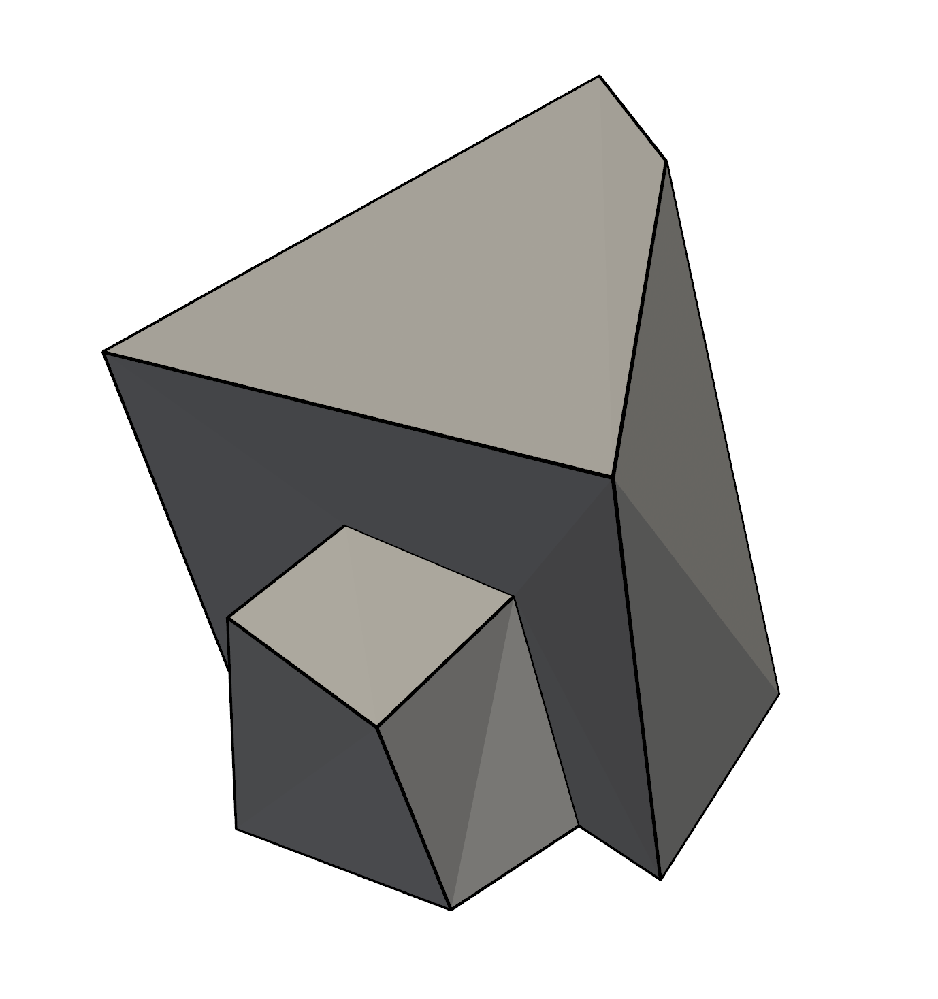
  <figcaption>Figure 5: Adding noise to each vertex reduces symmetry. </figcaption>
</figure>

### Independently Adjust Orientation of Each Left/Right Plane 
One can reduce symmetry while preserving planarity and parallelism in the following way.  

1. Generate a symmetrical two-box object. 
2. Compute planes for each face. 
3. Independently rotate the side planes by some user specified amount. The four side planes are those that contain vertices (0,2,6,4), (1,3,7,5), (8,10,14,12), (9,11,15,13), respectively. The rotation is done about each side-face's central point.  
4. Each vertex is defined as the intersection of three planes. With these four new planes, recompute all 16 intersection points.  

Below are some examples of the output of this process. Note that the current version of this code builds a shape with randomly rotated side faces, checks to make sure no invalid geometry is present and, if not, returns the 3D shape. If it is detected that a proposed asymmetrical object is self-intersecting, a new random rotation is sampled and a new 3D shape is built. There is a maximum number of attempts and if ```asym1``` fails to find a non-self-intersecting object in those attempts it returns ```None```. 

```{python}
obj = tbf.sample()
asym_obj = asym1(obj, np.radians(np.array([20,20,20,20]))) # each face randomly rotated 20 degrees
show_solid(asym_obj.xyz, obj.triangles, edges=obj.edges)
```

<figure>
  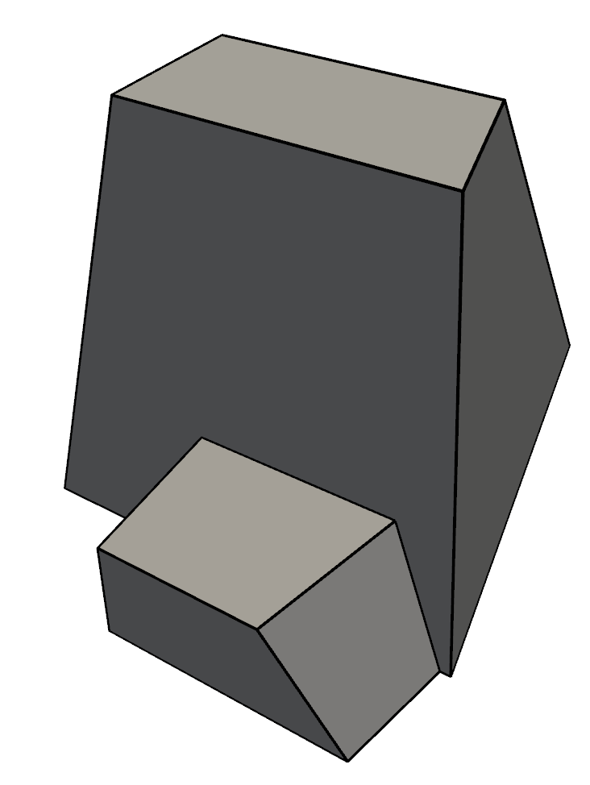
  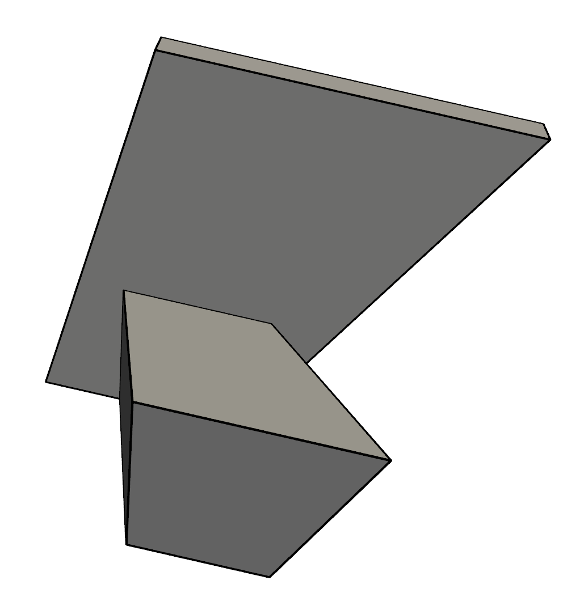
  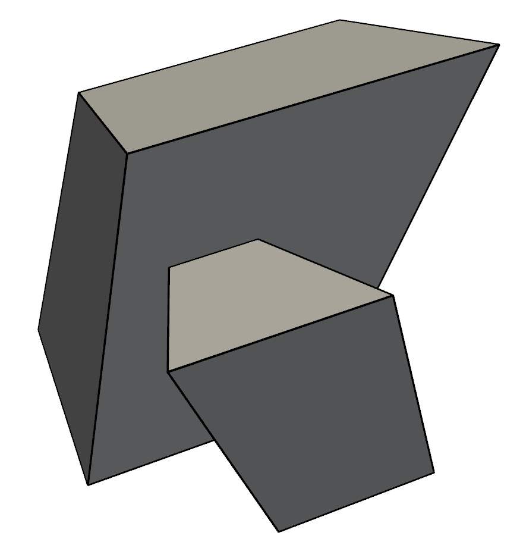
  <figcaption>Figure 6: Randomly perturbing the orientation of the planes on the sides results in asymmetrical objects with planar faces and many parallel line segments. </figcaption>
</figure>

